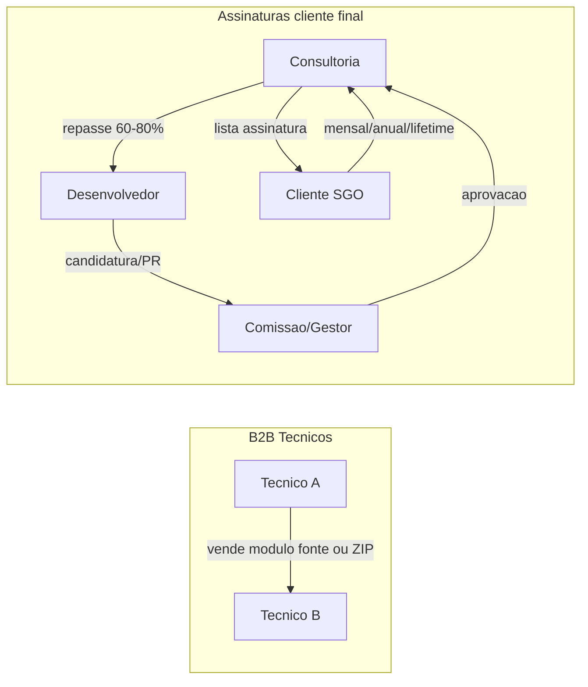

# Marketplace SGO e sistema de assinaturas

## Contexto

- **Já existe:** em cada admin SGO, instalação de módulos por link ([chassi/backend/src/routes/install-from-link.ts](chassi/backend/src/routes/install-from-link.ts)) e upload de ZIP ([upload-module](chassi/backend/src/routes/upload-module.ts)). O marketplace será a **origem** dos links e do catálogo; o chassi continua instalando via link ou ZIP.
- **Comunidade externa:** Circle, grupos WhatsApp para técnicos — considerada no desenho (perfis, relevância, descoberta), sem implementar a comunidade no primeiro escopo.
- **Visão de lab e N2:** continua conforme [docs/architecture/MODULES-LAB-VISAO.md](docs/architecture/MODULES-LAB-VISAO.md); o marketplace é a camada de **distribuição e monetização** para técnicos credenciados e para a consultoria.

---

## Dois eixos do marketplace

### 1. Marketplace B2B (técnico → técnico)

- **Modelo:** e-commerce simplificado (estilo CodeCanyon). Técnico credenciado publica módulo (código fonte e/ou ZIP buildado).
- **Comprador:** outro técnico. Compra única (não assinatura).
- **Repasse:** exemplo 80% ao desenvolvedor; percentual a definir; consultoria fica com a margem.
- **Entrega:** após pagamento, comprador recebe link de download (ZIP e/ou repositório/source) e pode instalar no(s) chassi(s) via **instalação por link** já existente no admin.
- **Gratuitos:** módulos gratuitos permitidos; aumentam relevância do técnico no marketplace (perfil visível para clientes finais).

### 2. Sistema de assinaturas (cliente final global SGO)

- **Modelo:** módulo disponível como assinatura (mensal, anual, lifetime) para **qualquer instalação SGO** (clientes finais). Não é venda entre técnicos; é catálogo global gerido pela consultoria.
- **Fluxo de entrada do módulo:**
  1. Desenvolvedor submete módulo como **candidato** (espécie de PR / processo de curadoria).
  2. **Comissão / grupo gestor** (consultoria + técnicos) avalia (qualidade, segurança, contrato SGO).
  3. Aprovado → consultoria **lista no catálogo de assinaturas**.
- **Gestão:** consultoria controla preços, planos (mensal/anual/lifetime) e **repasse ao desenvolvedor** (ex.: 60–80%, a definir).
- **Cliente final:** na sua instalação SGO (ou numa loja integrada), assina o módulo; a consultoria processa pagamento e repassa ao dev; o chassi continua instalando/ativando via link ou licença (entregue pelo backend da consultoria/Nexus).

---

## Perfis de técnicos e descoberta

- **Perfil público do técnico:** nome, módulos publicados (B2B e/ou em assinatura), módulos gratuitos, relevância (ex.: quantidade de downloads, módulos no catálogo global).
- **Descoberta por cliente final:** clientes SGO podem ver perfis de técnicos e seus módulos para **encontrar técnicos para projetos** (desenvolvimento sob encomenda, suporte).
- **Projetos:** podem ser independentes (cliente contrata técnico direto) ou **compartilhados** (consultoria gere o projeto e aloca técnicos). Não implementar projetos no MVP do marketplace; deixar desenhado para fase posterior.

---

## Onde cada coisa vive

| Camada                              | Onde fica                                 | Observação                                                                                                                      |
| ----------------------------------- | ----------------------------------------- | ------------------------------------------------------------------------------------------------------------------------------- |
| Instalação no chassi                | Já existe                                 | Upload ZIP + instalação por link no admin de cada SGO.                                                                          |
| Catálogo e pagamentos B2B           | Sistema à parte (e-commerce simplificado) | Técnico publica, outro técnico compra, recebe link; repasse ao dev.                                                             |
| Catálogo e pagamentos de assinatura | Sob gestão da consultoria                 | Pode ser no Nexus (novo módulo “marketplace”) ou app separado; consultoria define preços e repasses.                            |
| Perfis de técnicos                  | Mesmo sistema do marketplace              | Visíveis para técnicos (B2B) e para clientes finais (descoberta + projetos futuros).                                            |
| Comunidade (Circle, WhatsApp)       | Externa                                   | Integração opcional: link para perfil no marketplace, badges, “técnico credenciado”; sem build da comunidade no escopo inicial. |

---

## Receitas e repasses (a definir)

- **B2B:** venda módulo técnico → técnico; exemplo repasse 80% ao desenvolvedor.
- **Assinaturas:** cliente final paga mensal/anual/lifetime; exemplo repasse 60–80% ao desenvolvedor; consultoria com margem e gestão.
- **Módulos gratuitos (B2B ou no catálogo):** aumentam relevância do perfil; possível critério para candidatura ou destaque no marketplace.

---

## Passos para tornar real (ordem sugerida)

1. **Documentar o modelo**
  Criar/atualizar doc de produto (ex.: `docs/architecture/MARKETPLACE-VISAO.md`) com: dois eixos (B2B vs assinatura), fluxo de candidatura, repasses, perfis e descoberta, e menção à comunidade externa (Circle, WhatsApp).
2. **Definir escopo do “e-commerce simplificado”**
  MVP B2B: cadastro de técnico credenciado, publicação de módulo (ZIP e/ou oferta de fonte), listagem, compra única, geração de link de download, e integração com gateway de pagamento; repasse ao dev (percentual configurável).
3. **Definir escopo do sistema de assinaturas**
  Candidatura (submissão + painel para comissão), aprovação, listagem no catálogo global, planos (mensal/anual/lifetime), pagamento pelo cliente final, ativação/renovação na instalação SGO (via link/licença), e repasse ao desenvolvedor.
4. **Desenhar integração com o chassi**
  Manter [install-from-link](chassi/backend/src/routes/install-from-link.ts) como mecanismo de instalação; o marketplace (ou Nexus) gera URLs de download autenticadas/tokenizadas para o admin SGO; opcionalmente, endpoint no chassi para “licença de assinatura” (validar com backend da consultoria).
5. **Perfis e relevância**
  Entidades: técnico (perfil público), módulos (B2B vs assinatura vs gratuito). Métricas simples para relevância (ex.: módulos aprovados em assinatura, downloads gratuitos) para ordenação e exibição a clientes finais.
6. **Comunidade externa**
  Sem build inicial; apenas: campos ou links no perfil do marketplace para “perfil no Circle” / “grupo WhatsApp”; e menção na doc de que técnicos credenciados podem fazer parte da comunidade externa.
7. **Projetos (fase posterior)**
  Deixar descrito na doc: cliente final descobre técnico pelo perfil; projetos podem ser diretos (cliente ↔ técnico) ou compartilhados (consultoria gestiona). Implementação em sprint futuro.

---

## Resumo

- **B2B:** marketplace à parte; técnico vende módulo (fonte/ZIP) a outro técnico; compra única; repasse ~80% ao dev; instalação no chassi via link já existente.
- **Assinaturas:** consultoria lista módulos aprovados (após candidatura/comissão); cliente final assina (mensal/anual/lifetime); repasse 60–80% ao dev; gestão e receita da consultoria.
- **Perfis:** técnicos visíveis; módulos gratuitos aumentam relevância; clientes finais usam para achar técnicos para projetos (projetos em fase posterior).
- **Comunidade:** Circle e WhatsApp fora do sistema; marketplace pode referenciar e reforçar credenciamento/relevância.

Nenhuma alteração de código neste plano; apenas definição de produto e arquitetura e passos para implementação futura.